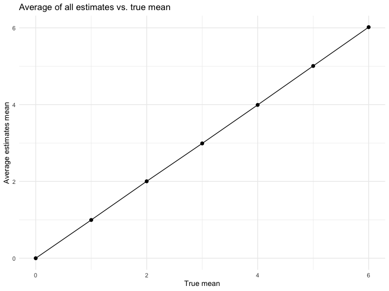

p8105_hw5_yh3554
================

## Problem 1

First create a dataframe `full_df`that includes all data files from the
directory `data/`and complete path to each file. Then use `map` over
paths and read data using the `read_csv` function.

``` r
full_df = 
  tibble(
    files = list.files("data/"),
    path = str_c("data/", files)
  ) %>% 
  mutate(data = map(path, read_csv)) %>% 
  unnest(cols = c(data))
```

To tidy data dataframe need to use string manipulations on the file,
converting from wide to long, and selecting relevant variables.

``` r
tidy_df = 
  full_df %>% 
  mutate(
    files = str_replace(files, ".csv", ""),
    group = str_sub(files, 1, 3)) %>% 
  pivot_longer(
    week_1:week_8,
    names_to = "week",
    values_to = "outcome",
    names_prefix = "week_") %>% 
  mutate(week = as.numeric(week)) %>% 
  select(group, subj = files, week, outcome)
```

Creates a plot showing individual data, faceted by group.

``` r
tidy_df %>% 
  ggplot(aes(x = week, y = outcome, group = subj, color = group)) + 
  geom_point() + 
  geom_path() + 
  facet_grid(~group)
```


Based on the spaghetti plots, the outcome of experiment group increase
over time, but the control group not change much over time. The plots
suggest high within-subject correlation – subjects who start above
average end up above average, and those that start below average end up
below average.

## Problem 2

#### Read the data

``` r
homicide_df = read_csv("data_homicide/homicide-data.csv", show_col_types = FALSE)
```

#### Table of proportion of missing data

``` r
homicide_df %>% 
  summarise_at(vars(lat:disposition), .funs = function(x) mean(is.na(x))) %>%
  knitr::kable()
```

|       lat |       lon | disposition |
|----------:|----------:|------------:|
| 0.0011499 | 0.0011499 |           0 |

#### Describle the raw data

The `homicide_df` is data contains homicides in 50 large U.S. It has
52179 variables and 12 cases. The key variables are unique id, victim
demographic information (first name, last name, age, sex), the location
(city, state, latitude, longitude), and disposition. It has 60 missing
latitude information and 60 missing longitude information.

#### Generate new dataframe

Create `city_state` variable by combining city and state variales. Then
summarize within citries to obtain the total number of homicides and
number of unsolved homicides (disposition is “Closed without arrest” or
“Open/No arrest”).

``` r
homicide_tidy <- homicide_df %>% 
  mutate(
    city_state = str_c(city, state, sep = ", ")) %>%
  group_by(city_state) %>%
  summarize(
    homi_tot = n(),
    homi_unsolved = sum(disposition == "Closed without arrest") 
    + sum(disposition == "Open/No arrest" )
  ) %>%
  arrange(desc(homi_tot))

head(homicide_tidy)
```

    ## # A tibble: 6 × 3
    ##   city_state       homi_tot homi_unsolved
    ##   <chr>               <int>         <int>
    ## 1 Chicago, IL          5535          4073
    ## 2 Philadelphia, PA     3037          1360
    ## 3 Houston, TX          2942          1493
    ## 4 Baltimore, MD        2827          1825
    ## 5 Detroit, MI          2519          1482
    ## 6 Los Angeles, CA      2257          1106

#### Proportion of homicides that are unsolved for city of Baltimore

Calculate proportion of homicides that are unsolved for city of
Baltimore using `prop.test` and save output as R object. Apply
`broom::tidy` to pull the estimated proportion and confidence interval.

``` r
prop_test_output <- prop.test(
  homicide_tidy %>%  filter(city_state == "Baltimore, MD") %>% pull(homi_unsolved),
  homicide_tidy %>%  filter(city_state == "Baltimore, MD") %>% pull(homi_tot))
  
save(prop_test_output, file = "prop_test_output.RData")

prop_test_output %>%
  broom::tidy() %>%
  select(estimate, conf.low, conf.high)
```

    ## # A tibble: 1 × 3
    ##   estimate conf.low conf.high
    ##      <dbl>    <dbl>     <dbl>
    ## 1    0.646    0.628     0.663

#### Proportion of homicides that are unsolved for each city

Run `prop.test` to calculate proportion of homicides that are unsolved
for each city, first generate a function that

``` r
prop_test_all_cities <- 
  purrr::map2_df(.x = homicide_tidy$homi_unsolved,
            .y = homicide_tidy$homi_tot,
            ~broom::tidy(prop.test(.x, .y))) %>%
  select(estimate, conf.low, conf.high) %>%
  mutate(city_state = homicide_tidy$city_state) %>%
  relocate(city_state) %>%
  arrange(desc(estimate))

head(prop_test_all_cities)
```

    ## # A tibble: 6 × 4
    ##   city_state         estimate conf.low conf.high
    ##   <chr>                 <dbl>    <dbl>     <dbl>
    ## 1 Chicago, IL           0.736    0.724     0.747
    ## 2 New Orleans, LA       0.649    0.623     0.673
    ## 3 Baltimore, MD         0.646    0.628     0.663
    ## 4 San Bernardino, CA    0.618    0.558     0.675
    ## 5 Buffalo, NY           0.612    0.569     0.654
    ## 6 Miami, FL             0.605    0.569     0.640

#### Plot of estimated CI for each city

``` r
prop_test_all_cities %>% 
  mutate(city_state = fct_reorder(city_state, estimate)) %>% 
  ggplot(aes(x = city_state, y = estimate)) +
  geom_point() + 
  geom_errorbar(aes(ymin = conf.low, ymax = conf.high)) +
  labs(title = "Estimate Proportion of unsloved homicides by city", 
       x = "City",
       y = "Estimate") +
  theme(axis.text.x = element_text(angle = 90, vjust = 0.5, hjust = 1), 
        legend.position = "none")
```


## Problem 3

This problem will conduct a simulation to explore power of one sample t
test.  
First set up the model and t test  
X \~ N($\mu$, $\sigma$)  
n = 30, $\sigma$ = 5  
$H_0$ : $\mu$ = 0 where $\alpha$ = 0.05  

``` r
set.seed(1)
sim_fn <- function(n = 30, mu = 0, sigma = 5){
  
  sim_data = tibble(
    x = rnorm(n, mean = mu, sd = sigma))
  
  result = sim_data %>% t.test(mu = 0, alpha = 0.05) %>%
    broom::tidy() %>%
    select(estimate, p.value)
  
  result
}

sim_fn()
```

    ## # A tibble: 1 × 2
    ##   estimate p.value
    ##      <dbl>   <dbl>
    ## 1    0.412   0.629

Then generate a 5000 datasets for the model, repeat the test, and save
$\hat{\mu}$ and p-value.

``` r
sim_mu0 <- expand_grid(mu = 0, iter = 1:5000) %>% 
  mutate(
    est_df = map(.x = mu, ~sim_fn(mu=.x))) %>% 
  unnest(est_df)

head(sim_mu0)
```

    ## # A tibble: 6 × 4
    ##      mu  iter estimate p.value
    ##   <dbl> <int>    <dbl>   <dbl>
    ## 1     0     1    0.664  0.368 
    ## 2     0     2    0.551  0.534 
    ## 3     0     3    0.567  0.487 
    ## 4     0     4   -1.65   0.0599
    ## 5     0     5    1.19   0.229 
    ## 6     0     6    0.334  0.738

Repeat the same process for $\mu$ = {1,2,3,4,5,6}  

``` r
sim_mus <- expand_grid(mu = 1:6, iter = 1:5000)  %>%
mutate(
    est_df = map(.x = mu, ~sim_fn(mu=.x))) %>% 
  unnest(est_df)

head(sim_mus)
```

    ## # A tibble: 6 × 4
    ##      mu  iter estimate p.value
    ##   <int> <int>    <dbl>   <dbl>
    ## 1     1     1    2.11   0.0159
    ## 2     1     2    2.01   0.0183
    ## 3     1     3    0.165  0.839 
    ## 4     1     4    0.108  0.912 
    ## 5     1     5    1.56   0.0682
    ## 6     1     6    2.04   0.0252

Combine the result of $\mu$ = 0 and $\mu$ = {1,2,3,4,5,6}

``` r
sim_result <- rbind(sim_mu0, sim_mus)
```

#### Plot of proportion of times the null was rejected vs true value of $\mu$

``` r
sim_result %>%
  group_by(mu) %>%
  summarize(power = sum(p.value < 0.05)/n()) %>%
  ggplot(aes(x = mu, y = power)) + 
  geom_point() + 
  geom_line() +
  labs(title = "Power of t test for true value of mean", 
       x = "True Mean", 
       y = "Power")
```


Based on the plot, power increases as the effect size increase. The
greater true mean value has higher proportion of rejecting the
corresponding null hypothesis. There is rapid increasing pattern between
true mean 0 and true mean 3, it turns to be more and more stable after
true mean 4.

#### Plot of average estimate of $\hat{\mu}$ vs true $\mu$

``` r
sim_result %>% 
  group_by(mu) %>%
  summarize(avg_mu_hat = mean(estimate)) %>%
  ggplot(aes(x = mu, y = avg_mu_hat)) + geom_point(size = 2) + geom_line() +
  labs(title = "Average of all estimates vs. true mean",
       x = "True mean", 
       y = "Average estimates mean")
```



#### Plot of average estimate of $\hat{\mu}$ in samples where null was rejected

``` r
sim_result %>% 
  filter(p.value < 0.05) %>%
  group_by(mu) %>%
  summarize(avg_mu_hat = mean(estimate)) %>%
  ggplot(aes(x = mu, y = avg_mu_hat)) + geom_point(size = 2) + geom_line() +
  labs(title = "Average of rejectet estimates vs. true mean",
       x = "True mean", 
       y = "Average estimate mean")
```


#### Combine two plots

``` r
rej_est <- sim_result %>% 
  filter(p.value < 0.05) %>% group_by(mu) %>% 
  summarize(avg_est = mean(estimate)) %>% 
  ungroup()

full_est <- sim_result %>% 
  group_by(mu) %>% 
  summarize(avg_est = mean(estimate)) %>% 
  ungroup()
  
ggplot(full_est,aes(x = mu, y = avg_est)) +
  geom_line(aes(colour = "blue")) +
  geom_line(data = rej_est, aes(color = "red")) +
  scale_color_manual(name = " ", 
                     values = c("blue" = "blue", "red" = "red"),
                     labels = c('All Estimates','Rejected Estimates')) +
  geom_point(data = rej_est, color = "red") +
  labs(title = "All vs Rejected Estimates", 
       x = "True Mean",
       y = "Average estimate mean")
```


Based on the last plot, the sample average of $\hat{\mu}$ across tests
for which the null is rejected is not approximately equal to the true
value of $\mu$. For true mean 1 to 4, significant difference between
average estimated mean for rejected null values and true mean. The
simulated values can be very close to true mean or bigger to true mean
which would result a bigger estimated mean cause the t test more likely
to fail to reject the null. For true mean of 0 the average estimated
mean for rejected null values approximate the true mean because the
simulated value could be either positive or negative number which make
the estimate mean yields to 0. Power gets stronger as the effect size
increase. For true mean after 4, the average estimated mean for rejected
null values approximate the true mean because the simulated values are
close to true mean.
